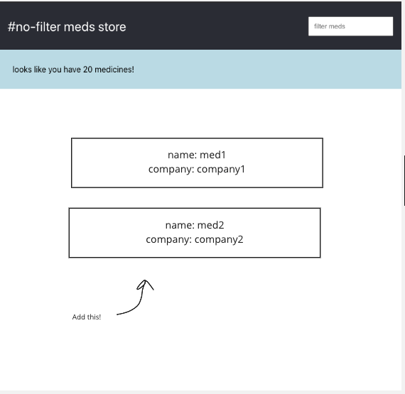

# 03 Project - hashtag-no-filter 

Use React components, state, and props to add search/filtering functionality to a medicine list app.

[TL;DR; video](https://www.loom.com/share/654407cd008a4bcb8b80349b56052009)

***Contents***
- [03 Project - hashtag-no-filter](#03-project---hashtag-no-filter)
  - [Brief](#brief)
  - [Rationale](#rationale)
  - [Instructions Part A - Render Medicine Details](#instructions-part-a---render-medicine-details)
  - [Instructions Part B - Implement Search Filter](#instructions-part-b---implement-search-filter)
  - [Instructions Part C - Add Syntactic Message Niceties.](#instructions-part-c---add-syntactic-message-niceties)
  - [Instructions Part D - Deploy The App](#instructions-part-d---deploy-the-app)
- [Submit your Project](#submit-your-project)

<hr>

<details>
  <summary>Marking Criteria</summary>
  <br />
  The following Learning Outcomes are assessed using the below criteria:

  <table>
    <tr>
      <td>LO4</td>
      <td>Demonstrate programming using logic, computational thinking and fundamental mathematical concepts, abstract reasoning and systems thinking.</td>
      <td>1 Credit</td>
    </tr>
    <tr>
      <td>LO5</td>
      <td>Install and configure a web-based solution using web scripting.</td>
      <td>1 Credit</td>
    </tr>
    <tr>
      <td>LO6</td>
      <td>Use software development standards to implement a user interface.</td>
      <td>1 Credit</td>
    </tr>
    <tr>
      <td>LO7</td>
      <td>Write scripts/code that adheres to coding standards to implement and customise a secure solution using frameworks and libraries.</td>
      <td>1 Credit</td>
    </tr>
    <tr>
      <td>LO8</td>
      <td>Implement responsive design (with device and platform independence) using basic principles of user interface design (UI), with considerations for user experience (Ux), HCI principles, and universal accessibility.</td>
      <td>1 Credit</td>
    </tr>
    <tr>
      <td>LO10</td>
      <td>Apply the basic principles of interaction design and human computer interaction employing current and emerging technologies.</td>
      <td>1 Credit</td>
    </tr>
    <tr>
      <td>LO14</td>
      <td>Migrate a web solution from development to a testing environment.</td>
      <td>1 Credit</td>
    </tr>
    <tr>
      <td>LO17</td>
      <td>Implement system data to a live platform.</td>
      <td>1 Credit</td>
    </tr>
    <tr>
      <td>LO18</td>
      <td>Deploy a solution from a test environment to a live platform.</td>
      <td>1 Credit</td>
    </tr>
    <tr>
      <td colspan="2">
        Total credit weighting counting towards the final grade of WDD03
      </td>
      <td>
        9 Credits<br />(30.00%)
      </td>
    </tr>
  </table>

  To receive the LO credits - all summative projects must receive a C- Grade
  (50% or higher).

  <table>
    <tr>
      <th>Project Component</th>
      <th>Acceptance criteria</th>
      <th>Component weighting</th>
      <th>Assessment Grade</th>
    </tr>
    <tr>
      <td>Part A</td>
      <td>
        Meets the acceptance criteria for Part A. Automated tests pass.
      </td>
      <td>20%</td>
      <td>18</td>
    </tr>
     <tr>
      <td>Part B</td>
      <td>
        Meets the acceptance criteria for Part B. Automated tests pass.
      </td>
      <td>20%</td>
      <td>20</td>
    </tr>
     <tr>
      <td>Part C</td>
      <td>
        Meets the acceptance criteria for Part C. Automated tests pass.
      </td>
      <td>20%</td>
      <td>20</td>
    </tr>
     <tr>
      <td>Part D</td>
      <td>
        Meets the acceptance criteria for Part D. Automated tests pass. Feedback
        completed.
      </td>
      <td>20%</td>
      <td>20</td>
    </tr>
    <tr>
      <td>Code quality</td>
      <td>
        Code looks professional and is formatted in a consistent manner. Code is
        easy to read and understand, with comments and well named functions and
        variables. There is little to no repetition in logic. No
        errors/bugs/syntax problems.
      </td>
       <td>15%</td>
      <td>13.50</td>
    </tr>
    <tr>
      <td>Development process</td>
      <td>
        Submitted correctly in GitHub Classrooms. Includes at least one commit
        per project part, demonstrating progression of development. Clear commit
        messages.
      </td>
       <td>5%</td>
       <td>5</td> 
    </tr>
    <tr>
      <th colspan="2" align="left">Total grade</th>
      <td>100%</td>
      <td>96.50</td>
    </tr>
  </table>
</details>

<details>
  <summary>Marking Scale</summary>
  <br />
  <table>
    <tr>
      <th>Marking Scale</th>
      <th>Descriptor</th>
    </tr>
    <tr>
      <td>10</td>
      <td>Excellent</td>
    </tr>
    <tr>
      <td>9</td>
      <td>Great</td>
    </tr>
    <tr>
      <td>8</td>
      <td>Very Good</td>
    </tr>
    <tr>
      <td>7</td>
      <td>Good</td>
    </tr>
    <tr>
      <td>6</td>
      <td>Average</td>
    </tr>
    <tr>
      <td>5</td>
      <td>Satisfactory</td>
    </tr>
    <tr>
      <td>4</td>
      <td>Some effort</td>
    </tr>
    <tr>
      <td>3</td>
      <td>Un-satisfactory</td>
    </tr>
    <tr>
      <td>2</td>
      <td>Incomplete</td>
    </tr>
    <tr>
      <td>1</td>
      <td>Poor</td>
    </tr>
    <tr>
      <td>0</td>
      <td>Did Not Complete</td>
    </tr>
  </table>
</details>

<br>

## Brief

At **#no-filter meds** store, there are so many medicines, it's hard to find exactly what you're looking for.

Let's improve the user experience by allowing the web application to filter by medicine or company name.

## Rationale

Filtering data on the client is a really common pattern! We'll also put into practice the React best practices we've learnt around component composition, React state, and props.

## Instructions Part A - Render Medicine Details

A basic layout already exists in the React app. Run `npm i && npm start` to spin it up. You should see a basic layout with a header and search box.

Run `npm test` to run the tests. They will gradually pass as you implement the required features. Check them out at `/src/components/App.test.js` to see how they work!

**Acceptance Criteria:**

- Display a list of medicines. Styles are up to your judgement, but display name and company details as per the mockup.
  - Each medicine item in the list should be a React component.



## Instructions Part B - Implement Search Filter

Update the app components to add the filter functionality to the search box.

**Acceptance Criteria:**

- When this box is empty all meds should be visible.

- When this box is populated the meds should filter on matches for medicine name OR company name.
  
- The filter term is case insensitive.

## Instructions Part C - Add Syntactic Message Niceties.

The medicine list message in the `Medicines` component should be correctly pluralised:

**Acceptance Criteria:**

- When more than one medicine: `Looks like you have x medicines!`

- When exactly one medicine: `Looks like you have 1 medicine!` (lose the `s`)

- When 0 medicine: `Looks like you don't have any medicines!`

## Instructions Part D - Deploy The App

Once you have Part's A, B, C functioning correctly, it's time to get the React application deployed!

**Acceptance Criteria:**

- Build and deploy your killer app to a publicly accessible site.

- Ensure it functions on mobile screens.

- Stick the public URL to your deployed app in `url-of-my-site.txt`.

--- 

# Submit your Project

- [ ] [Feedback](https://docs.google.com/forms/d/e/1FAIpQLSc5t9C5wsMNN7uDKTKvY6W7jKMU_9OE00KWnSjr3OCMS5Qj-w/viewform?usp=pp_url&entry.1220290274=Project&entry.1443355662=Hashtag+No+Filter) has been completed
- [ ] Commits are pushed to GitHub

---

<details>
  <summary>
    Git CLI Refresher
  </summary>

If you need help remembering what commands to type with `git`, use the following as a reference, or watch the [git walkthrough tutorial video](https://vimeo.com/433825571/bc1830fb90)

```shell
# when ready to commit and push
git add .

git commit -m "Completed Part A"

git push origin master
```

</details>
